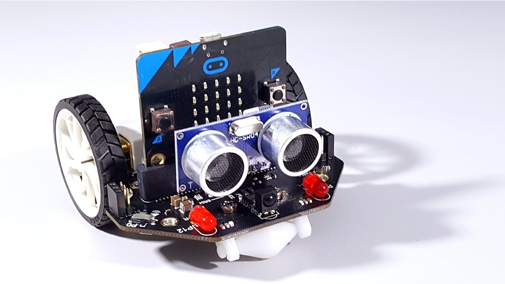
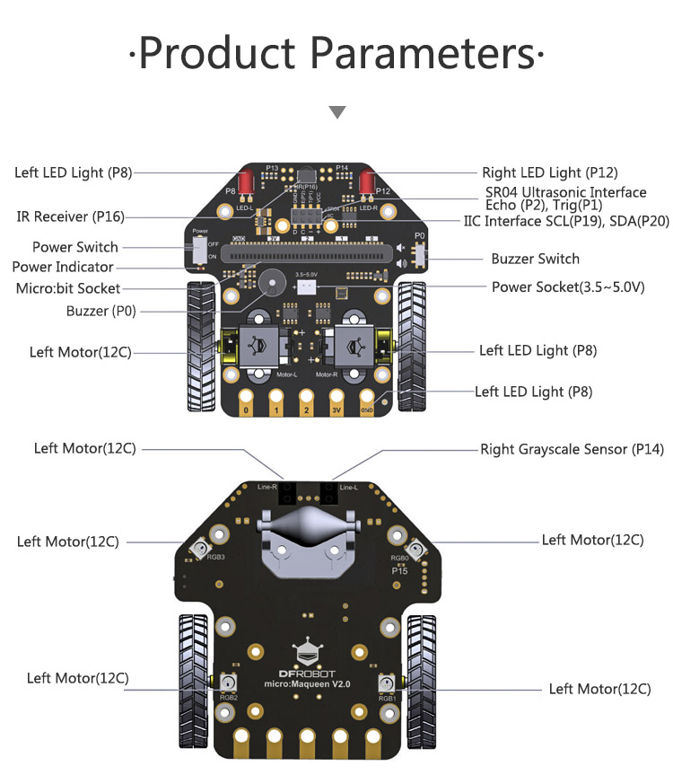
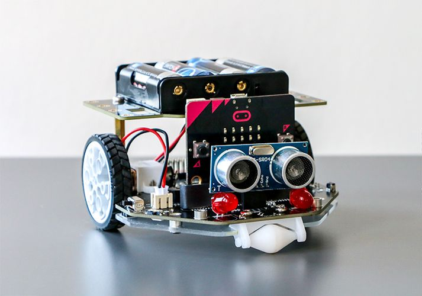
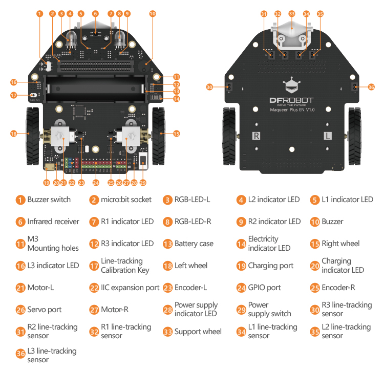

# Micro:bit Maqueen


## micro:Maqueen


### Tutorials
!!! Note
    These tutorials use block code. Block code is a good starting place if you have never coded but if you have some experience in coding it is better to understand and develop in a coding language like Python or Javascript with these bots. It is also possible to use other languages but check with your teacher before flashing the micro:bit.

- [I am Maqueen](https://wiki.dfrobot.com/micro_Maqueen_for_micro_bit_SKU_ROB0148-EN)

### Python API
- [Maqueen](https://makecode.microbit.org/pkg/dfrobot/pxt-maqueen)

#### Control Motor
!!! Note ""

    Control Maqueen's speed and movement.
    
    | Motor | Code |
    |----|----|
    | Left | maqueen.aMotors.M1
    | Right | maqueen.aMotors.M2

    | Direction | Code |
    |----|----|
    | Forward | maqueen.Dir.CW
    | Backward | maqueen.Dir.CCW

    **Speed:** 0 - 255

    ``` title='Example'
    maqueen.motor_run(maqueen.aMotors.M1, maqueen.Dir.CW, 0)
    ```
    
    ```py title='API'
    def maqueen.motor_run(index: aMotors, direction: Dir, speed: int) -> None
    ```

#### Stop Motor
!!! Note ""
    Stop a motor. The same as setting the motor speed to 0.
    
    | Motor | Code |
    |----|----|
    | Left | maqueen.aMotors.M1
    | Right | maqueen.aMotors.M2

    ``` title='Example'
    maqueen.motor_stop(maqueen.aMotors.M1)
    ```

    ```py title='API'
    def maqueen.motor_run(motors: aMotors) -> None
    ```
#### Stop All Motors
!!! Note ""
    Stop all motors. The same as setting M1 and M2 speed to 0.

    ``` title='Example'
    maqueen.motor_stop_all()
    ```

    ```py title='API'
    def maqueen.motor_stop_all() -> None
    ```

#### Ultrasonic Sensor
!!! Note ""
    Return the distance in centimetres or microseconds to a detected object.

    |PingUnit|Code|Notes|
    |----|----|----|
    |Centimetres|PingUnit.CENTIMETERS||
    |Microseconds|PingUnit.MICRO_SECONDS| The smaller the microseconds, the closer the object |

    ```py title='Example'
        maqueen.sensor(PingUnit.CENTIMETERS)
    ```

    ```py title='API'
    def maqueen.sensor(unit: PingUnit) -> int
    ```

#### Line Tracking Sensor
!!! Note ""
    Read the value of the line-tracking sensor on the bottom of the Maqueen car. 

    |Return Value|Description|
    |----|----|
    | 0 | Black is detected |
    | 1 | White is detected |

    |Patrol|Code|
    |----|----|
    | Left sensor | maqueen.Patrol.PATROL_LEFT |
    | Right sensor | maqueen.Patrol.PATROL_RIGHT |

    ```py title='Example'
    maqueen.read_patrol(maqueen.Patrol.PATROL_LEFT)
    ```

    ```py title='API'
    def maqueen.read_patrol(patrol: Patrol) -> int
    ```

## Maqueen Plus



### Tutorials
!!! Note
    These tutorials use block code. Block code is a good starting place if you have never coded but if you have some experience in coding it is better to understand and develop in a coding language like Python or Javascript with these bots. It is also possible to use other languages but check with your teacher before flashing the micro:bit.

- [Maqueen Plus V2 Getting started Tutorial](https://learn.dfrobot.com/course-671.html)
- [Introduction to Maqueen Plus V2 | Maqueen Plus V2 Getting started Tutorial 01](https://learn.dfrobot.com/makelog-313320.html)
- [Let's move, Maqueen! | Maqueen Plus V2 Getting started Tutorial 02](https://learn.dfrobot.com/makelog-313321.html)

### Python API
- [Maqueen Plus V2](https://makecode.microbit.org/pkg/DFRobot/pxt-DFRobot_MaqueenPlus_v20)